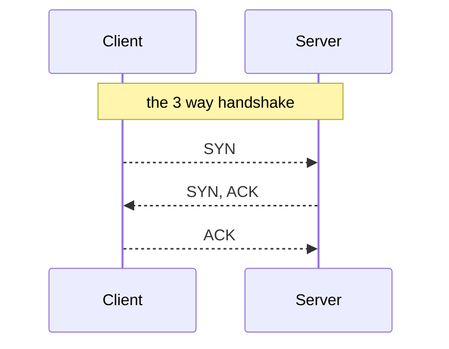

## Different Stages in making a connection in TCP

### Connection Establishment

## 🧠 What Happens Under the Hood?

### 1. Application Starts Listening (Server Side)

- The application calls `listen(address:port)`.
- **Why specify `address:port` instead of just `port`?**  
  A computer can have multiple network interfaces (e.g., Ethernet, Wi-Fi, loopback).
  - Binding only to a port (e.g., `0.0.0.0:8080`) listens on **all interfaces**, including public ones.
  - ❗ This is risky and can expose the application to the internet.
  - ✅ **Best practice**: Bind to a specific IP (e.g., `127.0.0.1:8080`) to restrict exposure.

---

### 2. Client Initiates Connection

- The client initiates a connection by sending a **SYN** packet.
- The client's kernel creates a socket and tracks the outgoing connection.

---

### 3. Kernel Handles the 3-Way Handshake (Server Side)

- When the server receives a SYN:
  - The kernel:
    - Creates an internal **socket** structure.
    - Adds the incoming request to the **SYN queue** (pending connections).
    - Sends back a **SYN-ACK**.
- When the final ACK is received from the client:
  - The kernel verifies it matches an entry in the SYN queue.
  - It **moves the connection to the Accept queue** (fully established).
  - The SYN queue entry is removed.

---

### 4. Application Accepts the Connection

- The server app calls `accept()`:
  - Removes one connection from the **Accept queue**.
  - Returns a **file descriptor (FD)** representing the connection.
- If no connections are available:
  - `accept()` **blocks** the calling thread/process.
  - To avoid blocking:
    - Use **non-blocking mode** (`O_NONBLOCK`)
    - Or use **async/event-driven** models (e.g., `select()`, `poll()`, `epoll()`)

---

## 🧵 Note: One Socket, Many Connections

- A listening socket can manage **many concurrent connections** and it is bound to a port.
- Each new connection gets a **new file descriptor** via `accept()`.

---

## ⚠️ What If Queues Are Full?

- **Accept queue full**:
  - New established connections are **dropped or refused**.
- **SYN queue full**:
  - Happens during **SYN flood** attacks (lots of SYNs without completing handshake).
  - Kernel cannot store new incoming connections in the SYN queue.
- 🔐 **SYN Cookies** (Enabled when syn queue is full):
  - Used to handle SYN floods by not allocating memory for the connection until ACK is received.
- **Backlog size**:
  - Set by the `listen(fd, backlog)` call.
  - OS may enforce limits:
    - **Linux default**: 128 to 1024
    - Controlled via:
      - `/proc/sys/net/core/somaxconn` (accept queue)
      - `/proc/sys/net/ipv4/tcp_max_syn_backlog` (SYN queue)

---

## 🚧 Common Issues

- **Slow `accept()` rate**:
  - The accept queue fills up, causing connection timeouts or drops.
- **SYN flood attack**:
  - Attackers send numerous SYNs, overwhelming the SYN queue.
  - Kernel allocates resources that never get cleaned up.
  - ✅ Use:
    - SYN cookies (do not use syn queue sends a hash wit secret key in ACK)
    - Rate limiting via firewalls
    - TCP-level protection like iptables or `nftables`
- **Improper binding**:
  - Binding to `0.0.0.0:PORT` exposes app to **all** interfaces.
  - Best practice: bind to loopback (`127.0.0.1`) or specific internal IPs.

---

## 🛠 Related Linux Kernel Parameters

- `tcp_max_syn_backlog`  
  File: `/proc/sys/net/ipv4/tcp_max_syn_backlog`  
  Controls the size of the SYN queue.

- `somaxconn`  
  File: `/proc/sys/net/core/somaxconn`  
  Limits the effective maximum of `listen(fd, backlog)` backlog size.

