# 🔐 Transport Layer Security (TLS)

**TLS (Transport Layer Security)** is a cryptographic protocol that provides secure communication over a computer network. It ensures **confidentiality**, **integrity**, and **authentication** between communicating applications.

- **Layer:** Transport Layer (Layer 5 or 6)
- **Underlying Protocol:** Built on top of **TCP (Transmission Control Protocol)**
- **Primary Use:** Encrypts data transmitted over the network to prevent eavesdropping or tampering.

Once a TLS connection is initiated, the **TLS Handshake** process begins. This handshake is critical in establishing cryptographic parameters before any secure data exchange.

---

# 🔁 TLS Handshake Overview

The TLS handshake involves the client and server exchanging several messages to:

- Agree on a shared **cipher suite**
- Authenticate the server (and optionally the client)
- Generate and exchange keys securely
- Establish encrypted communication

---

# 🔐 TLS 1.2 Handshake Sequence

Below is the typical handshake sequence for **TLS 1.2**, illustrated via a sequence diagram:

```mermaid
sequenceDiagram
    participant Client
    participant Server

    Note over Client,Server: 🕐 RTT 1 – Client initiates handshake

    Client->>Server: ClientHello
    Server->>Client: ServerHello
    Server->>Client: Certificate
    Server->>Client: ServerKeyExchange (if needed)
    Server->>Client: CertificateRequest
    Server->>Client: ServerHelloDone

    Note over Client,Server: 🕐 RTT 2 – Client responds with certificate & key exchange

    Client->>Server: ClientCertificate
    Client->>Server: ClientKeyExchange
    Client->>Server: CertificateVerify
    Client->>Server: ChangeCipherSpec
    Client->>Server: Finished (Encrypted)
    Server->>Client: ChangeCipherSpec
    Server->>Client: Finished (Encrypted)

    Note right of Client: 🔐 Encrypted communication begins
```

 

| Message                | Description                                                                                                |
| ---------------------- | ---------------------------------------------------------------------------------------------------------- |
| **ClientHello**        | Sent by the client. Proposes TLS version, supported cipher suites, random number, and optional extensions. |
| **ServerHello**        | Server responds with selected TLS version, cipher suite, random number, and optional extensions.           |
| **Certificate**        | Server provides its digital certificate for authentication (usually X.509).                                |
| **ServerKeyExchange**  | Optional. Sent if the key exchange algorithm requires additional parameters (e.g., Diffie-Hellman).  In the case where the public key is in the certificate sent this is ommited.      |
| **CertificateRequest** | Optional. Sent if the server requires client authentication (used in **mutual TLS / mTLS**).               |
| **ServerHelloDone**    | Indicates the server has completed its initial handshake messages.                                         |
| **ClientKeyExchange**  | Contains pre-master secret or public key, depending on the key exchange algorithm.                         |
| **Client Certificate** | Optional. Sent in response to `CertificateRequest` for mTLS.   
| **Certificate Verify** | Optional.  Sent by the client (only if the server sends a CertificateRequest) to prove possession of the private key associated with its certificate by signing the previous handshake messages.                                               |
| **ChangeCipherSpec**   | Indicates that subsequent messages will be encrypted using the negotiated keys and algorithms.             |
| **Finished**           | First encrypted message confirming the handshake integrity.                                                |
---
### ⏱ TLS 1.2 Handshake Timing

✅ **TLS 1.2 completes the full handshake in 2 RTTs**, even with **mutual TLS (mTLS)**.

All client responses — including the client certificate, key exchange data, and handshake verification — are sent in the **second round trip**.

### Image Ref 

---

### 🔎 Important Points to Note in TLS

- In **TLS**, the **client verifies the server's identity** using the server’s certificate.
- In **mutual TLS (mTLS)**, the **server also verifies the client’s identity** using the client’s certificate.
- **Data integrity** is ensured by cryptographic hash functions (e.g., HMAC), which protect against tampering.
- **Symmetric algorithms** (used for encrypting application data) are **much faster and less computationally intensive** than asymmetric algorithms.
- This speed difference exists because **asymmetric algorithms** perform complex mathematical operations like modular exponentiation, while **symmetric algorithms** rely on efficient bit-level operations.

---

### 🔐 What is HMAC?

**HMAC (Hash-based Message Authentication Code)** is a mechanism that combines a cryptographic hash function (like SHA-256) with a secret key to produce a message authentication code. This enables Hmac to be more secure as **Attackers cant calculate hmac without the secret**.

- It ensures **data integrity** and **authentication** by allowing the receiver to verify that the message has not been altered and comes from a trusted sender.
- In TLS, HMAC is used to protect handshake messages and encrypted application data against tampering.

### 🔧 How HMAC is Used in TLS

- During the TLS handshake and encrypted data exchange, both parties compute an HMAC over the messages using a **shared secret key** derived during the handshake.
- The HMAC is included with each message to allow the receiver to verify that the message is authentic and has not been modified.
- If the HMAC verification fails, the message is rejected, preventing tampering or forgery.
- This process helps provide **data integrity** and **authentication** at the record layer of TLS, complementing encryption.
---

## Optional mTLS

mTLS can be configured as **optional**, meaning the server requests a client certificate but does not require it to establish the TLS connection.

- In this mode, the **TLS handshake completes successfully at the TCP level** even if the client fails to provide a valid certificate.
- The server receives information about the client certificate (or its absence) and may allow the connection to proceed.
- However, if client authentication is required for application access, the server can **reject the request at the application layer**, for example by returning an HTTP 400 or 403 error.
- This approach allows flexible handling of clients with and without certificates without dropping the TCP connection outright.

The older TLS are deprecated as they support weak ciphers(1.1) or they have a vulnerability(BEAST in 1.0).

