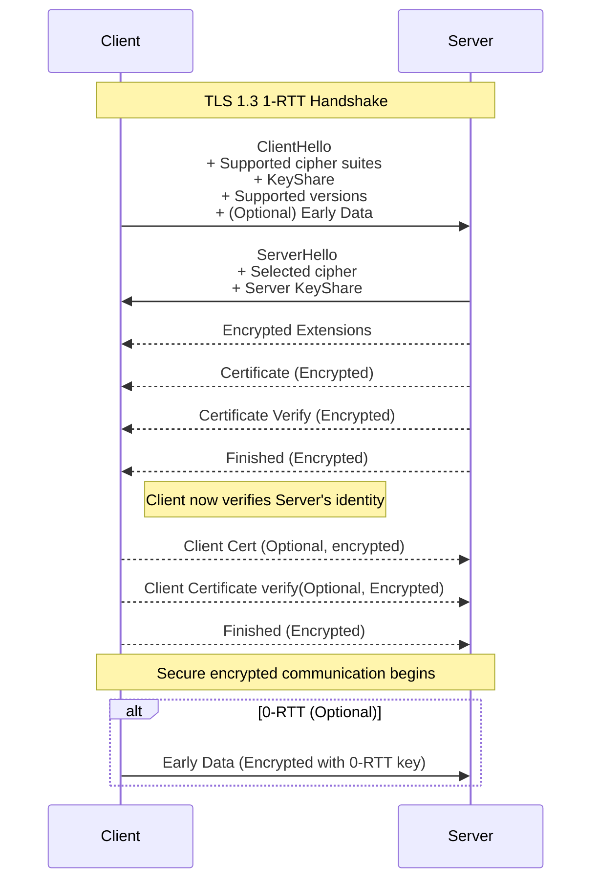

# TLS 1.3 Overview

TLS (Transport Layer Security) 1.3 is the latest version of the TLS protocol, designed to provide improved security and performance over its predecessors. It simplifies the handshake process, removes outdated cryptographic algorithms, and ensures stronger privacy guarantees.

## Key Changes in TLS 1.3

### 1. Deprecation of RSA Key Exchange

In TLS 1.3, RSA-based key exchange has been **deprecated**. This is because RSA key exchange does **not support forward secrecy**. If a server's private key is compromised, all past communications encrypted using that key can potentially be decrypted. 

Instead, TLS 1.3 exclusively uses **ephemeral Diffie-Hellman (DHE) or Elliptic Curve Diffie-Hellman Ephemeral (ECDHE)** key exchanges, which generate new key pairs for each session. This ensures **forward secrecy**, meaning past communications remain secure even if the server's private key is later exposed.

---

### 2. Reduced Round-Trip Time (RTT)

TLS 1.3 improves connection setup speed by reducing the handshake to **one round-trip (1-RTT)**. This is a significant improvement over TLS 1.2, which typically required two or more RTTs.

### 3. All handshake messages after the ServerHello are now encrypted.
The newly introduced EncryptedExtensions message allows various extensions previously sent in the clear in the ServerHello to also enjoy confidentiality protection.

#### Handshake Simplification:

- The **client** begins the handshake by sending a **ClientHello** message.
  - This message includes:
    - Supported cipher suites
    - Key share(s) (e.g., for ECDHE)
    - Supported protocol versions
    - A precomputed key share to enable early key agreement

- The **server** responds with a **ServerHello**, selecting:
  - The protocol version
  - Cipher suite
  - Its own key share

- Both parties now have enough information to compute the **shared secret** and derive the session keys.

- Encrypted communication can begin immediately after the ServerHello.

This streamlined process makes TLS 1.3 faster and more efficient, particularly beneficial in latency-sensitive environments.

---

Here one more notable change is that there us a certificate verify sent by the server which was not in the TLS 1.2. 
This is because there is no server key exchange so we are sending the message sign in the new message.

## ⚡ 0-RTT Data in TLS 1.3

One of the key performance features introduced in TLS 1.3 is **0-RTT (Zero Round-Trip Time) data**. It allows clients to send **application data immediately with the first handshake message** (`ClientHello`), reducing latency for resumed sessions.

### 🚀 How 0-RTT Works

- 0-RTT is only available **when resuming a previous session** using a **Pre-Shared Key (PSK)**, typically established in a past full handshake.
- The server provides the client with a **session ticket** during the initial connection.
- When reconnecting, the client includes:
  - A **PSK identity**
  - A key share
  - **Early application data**, encrypted with an early traffic key derived from the PSK

This enables the client to send encrypted data **immediately**, without waiting for the server to respond — achieving **true 0-RTT** latency.

---

### ✅ Benefits of 0-RTT

- 🕒 **Ultra-low latency** for resumed connections
- 🔄 **Fast reconnects** for clients frequently connecting to the same server
- 🌐 **Better user experience** for web, mobile, and real-time applications

---

### ⚠️ Security Trade-Offs of 0-RTT

- 🔁 **Replay attacks**: Early data may be replayed by attackers if not properly protected at the application layer.
- 🔐 **No forward secrecy**: 0-RTT data is not protected by fresh ephemeral key exchange.
- ⚙️ **Server complexity**: Servers must decide whether to accept, reject, or delay early data processing.

---

### 🔒 Server-Side Protections

- Accept only **idempotent requests** (e.g., `GET` but not `POST`)
- Use **application-layer replay protection** (timestamps, nonces, etc.)
- Maintain **anti-replay state** (if possible, though costly at scale)

---

### ✍️ Example: HTTP over TLS 1.3 with 0-RTT

✅ Here’s what happens:
The client resumes a session using a PSK from a previous connection.

It sends:

ClientHello
    - PSK identity
    - KeyShare
    - Early application data (0-RTT)

The server still must respond with:

ServerHello (to confirm negotiated parameters and resume)

EncryptedExtensions, Finished, etc.

➡️ So yes — ServerHello is still part of the handshake, but the early data is sent before it's received, which is why it’s called 0-RTT. The handshake is happening in the background while the early data is already in flight.

### ❗ Important Notes

- 0-RTT is **optional** and only used for **resumed sessions**.
- If the server **rejects** the early data, the client must **retry** after completing the full handshake.
- Not all TLS 1.3 implementations or applications support 0-RTT due to its complexity and risks.

