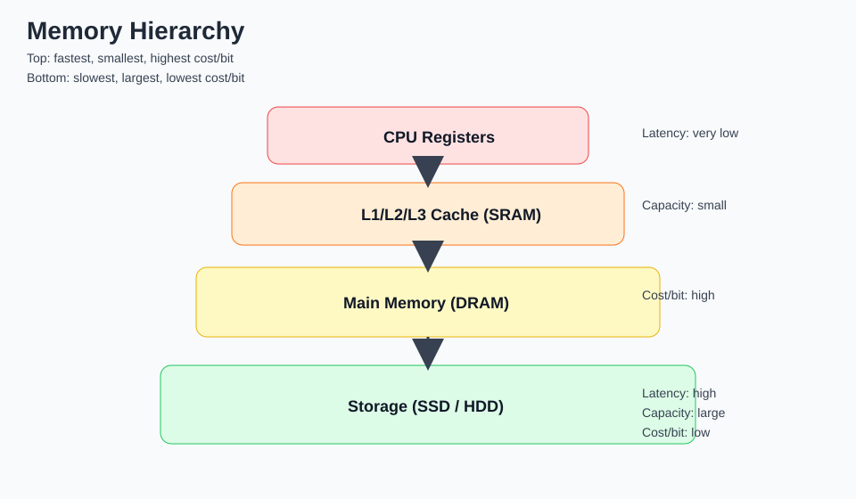
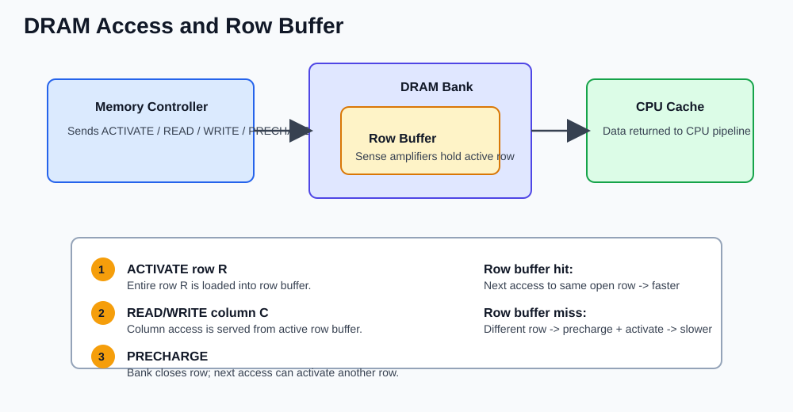
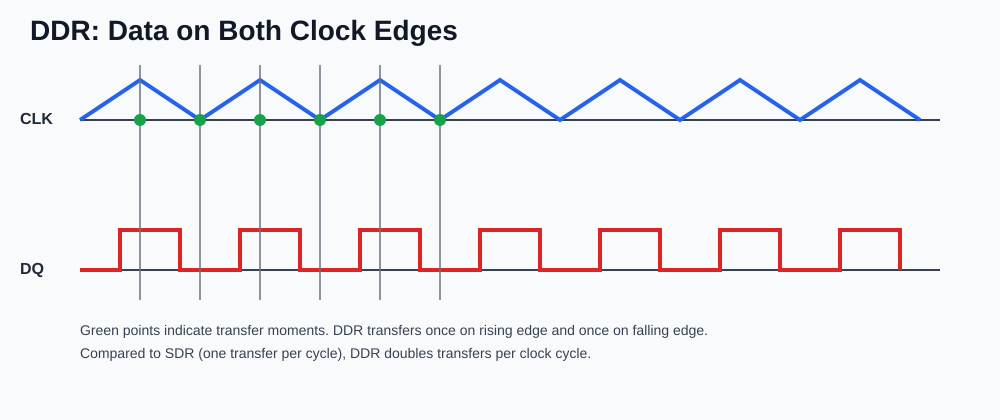
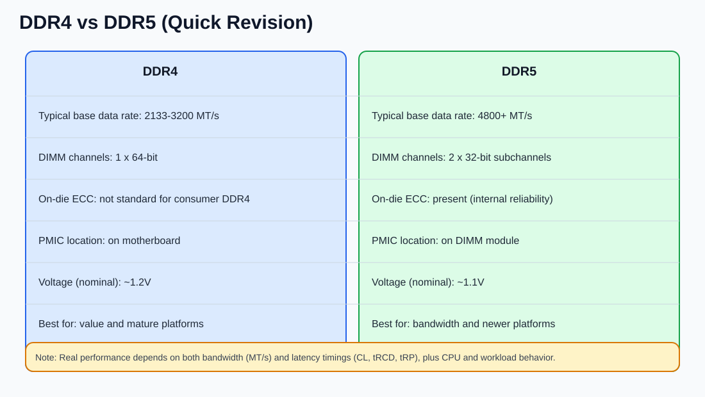
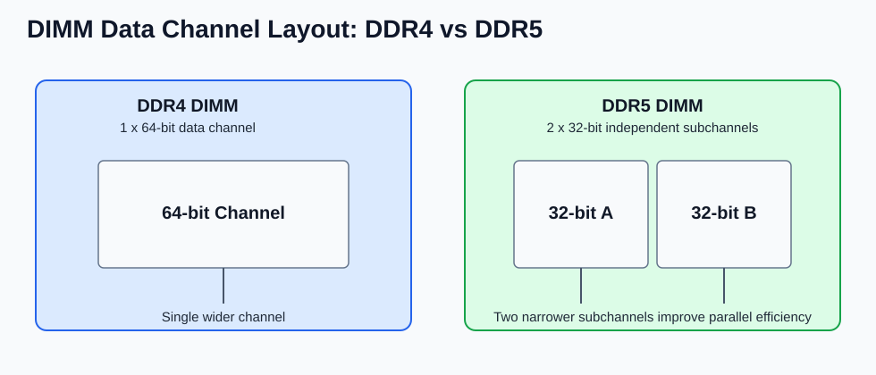

## Anatomy of memory

### Memory basics

Memory stores data and instructions needed by the CPU.

Volatile memory:

- Loses data when power is off
- Example: RAM

Non-volatile memory:

- Retains data without power
- Examples: SSD, HDD, ROM, flash

RAM allows direct access to any address (random access), unlike sequential-only access models.

### Memory hierarchy (fastest/smallest -> slowest/largest)

- CPU registers
- L1/L2/L3 cache (SRAM)
- Main memory (DRAM)
- SSD/HDD (storage)

Key trade-off:

- Closer to CPU -> faster, smaller, more expensive per bit
- Farther from CPU -> slower, larger, cheaper per bit

### Static RAM (SRAM)

Fast and expensive

Stores 1 bit using a flip-flop (typically 6 transistors)

No periodic refresh needed while power is on

Lower density than DRAM (takes more area per bit)

Common uses:

- CPU caches (L1/L2/L3)
- Small on-chip buffers

Main idea: very low latency, but costly for large capacity

### Dynamic RAM (DRAM)

Cheaper and higher density than SRAM, but slower

Stores 1 bit using 1 transistor + 1 capacitor (1T1C cell)

Capacitor charge leaks over time, so data must be refreshed periodically

Refresh is handled automatically by the memory controller

Reads are sensed via sense amplifiers after activating a row

Main use:

- System main memory (RAM modules)

### Why DRAM is slower than SRAM

- Requires row activation/precharge steps
- Requires periodic refresh cycles
- Access timing constraints are stricter

### DRAM organization (important)

- Cell arrays are organized into rows and columns
- Multiple banks allow overlap of operations
- Access pattern: activate row -> read/write columns -> precharge

If accesses are sequential within an open row (row buffer hit), performance is better.

### Synchronous DRAM and DDR

Modern DRAM is synchronous (SDRAM): operations are coordinated with a clock.

DDR (Double Data Rate) transfers data on both rising and falling clock edges, increasing bandwidth; in SDR, data is transferred only on one edge (typically the rising edge).

Examples: DDR3, DDR4, DDR5 (newer generations generally improve bandwidth and efficiency).

### DDR4 and DDR5 

Focus: DDR4 and DDR5 (not covering DDR1/DDR2/DDR3 details here).

CPU read goal:

- CPU commonly works with a 64-byte cache line
- Memory reads are designed to efficiently return at least this unit

Data bus idea:

- A DIMM has many physical pins overall
- The data bus we care about here is 64 data lines (64 I/O pins)
- Think of each data pin as carrying 1 bit lane

### Prefetch and burst intuition

Memory access is expensive (activate row, sense, transfer), so when DRAM is already accessed, it returns a chunk (burst) instead of a tiny piece.

### DDR generations by prefetch per I/O pin

- DDR1: 2 bits per I/O pin
- DDR2: 4 bits per I/O pin
- DDR3: 8 bits per I/O pin
- DDR4: 8 bits per I/O pin (kept same prefetch depth, improved transfer speed/optimizations)

### DRAM internals 

#### Physical path

- RAM sticks (DIMMs) sit in motherboard slots
- CPU talks to memory through the memory bus and memory controller
- Bus distance/signaling has cost (latency, power)
- Some modern designs place memory very close to CPU/on-package to reduce interconnect cost

#### DRAM structure

- DIMM contains DRAM chips
- Chips are organized into banks
- Each bank has many rows
- Each row has many columns
- Columns map to many cells
- A cell is typically modeled as 1 capacitor + 1 transistor storing 1 bit

#### Address mapping idea

Physical address bits are decoded into fields like:

- Bank bits
- Row bits
- Column bits

So an address effectively selects bank + row + column.

Exact mapping is controller/vendor-specific and can be hard to reverse engineer.

#### Why row activation is expensive

To read DRAM, controller typically:

- Activates a row (loads it into sense amplifiers / row buffer)
- Reads or writes one or more columns from that active row
- Eventually precharges/closes row when switching

Activation/precharge is expensive compared with a row-buffer hit.

#### One active row per bank (typical model)

- A bank usually has one active row at a time
- Sense amplifiers are shared per bank (not per row)
- If next access is same open row -> fast (row-buffer hit)
- If next access needs different row in same bank -> precharge + activate (row-buffer miss/conflict)

#### Why access patterns matter

- Sequential physical addresses often benefit from open-row locality
- Random addresses can cause frequent row switches (thrashing)
- More banks help because different banks can have different active rows in parallel

#### Practical latency intuition

- First access to a row can be much slower (tens of ns scale)
- Follow-up accesses that hit active row are much faster
- Refresh and scheduling effects add timing variability between runs

#### Virtual vs physical locality note

- Program sees virtual addresses
- DRAM controller works with physical addresses
- Virtual adjacency does not always guarantee best DRAM locality

### DDR4 burst view

- 64 data pins x 8 bits per pin = 512 bits
- 512 bits / 8 = 64 bytes

So one DDR4 burst naturally gives 64 bytes, which matches a CPU cache line well.

### Why this behavior exists

- DRAM work is not free: capacitors, sense amplifiers, row operations
- Access can be on the order of ~100 ns, so returning a burst is more efficient than tiny reads

### DDR5 main idea

DDR5 increases prefetch to 16 bits per I/O pin.

If we kept a single 64-bit data path:

- 64 x 16 = 1024 bits = 128 bytes per burst

That can exceed the typical 64-byte unit the CPU wants for one cache line.

### DDR5 channel split

To keep useful transfer size and improve parallelism, DDR5 splits into two channels/subchannels:

- Channel A: 32 data pins
- Channel B: 32 data pins

Per channel burst math:

- 32 x 16 = 512 bits = 64 bytes

So each channel can still deliver a 64-byte burst, while two channels improve concurrency.

### Why DDR5 can be faster (from this model)

- Higher prefetch depth
- Channel-level parallelism (independent channel activity)
- Better effective bandwidth/concurrency than a single locked path

### Compatibility note

CPU/memory controller must support DDR5 channel behavior; otherwise the system cannot use DDR5 mode.

### Asynchronous DRAM (legacy)

Older DRAM types were asynchronous (not coordinated by a system clock).

The CPU/memory controller had to wait for DRAM timing signals directly, which reduced throughput and made timing harder.

Common legacy examples: FPM DRAM, EDO DRAM.

Modern systems use SDRAM/DDR instead of asynchronous DRAM for better performance and predictability.

### Important performance terms

- Latency: time for one access to complete
- Bandwidth: amount of data transferred per second

Rule of thumb:

- Caches primarily reduce effective latency
- Wider/faster memory channels improve bandwidth

### Cache interaction with DRAM

CPU checks cache first.

On cache miss, data is fetched from DRAM into cache, then used by CPU.

So CPU does not normally operate directly on DRAM cells.

### Extra practical points

- Memory channels: dual/quad channel can increase throughput
- ECC memory: detects/corrects certain bit errors (common in servers)
- Locality matters:
    - Temporal locality: recently used data likely reused
    - Spatial locality: nearby addresses likely accessed soon

Locality is why caches improve performance so much.

