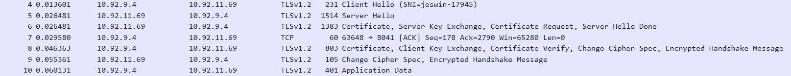

## TLS

TLS is a transport layer protocol (Layer 4) built over TCP.

TLS is used to encrypt the content being sent in TCP connection.

Once the TLS connection is setup the TLS handshake will occue.

## 🔐 TLS 1.2 Handshake Sequence

